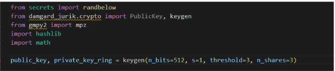

## Introduction

The goal of this project is to explore the cryptography behind zero-knowledge proofs and create
some practical constructions of ZKPs as described in these papers by Damgard and Jurik -
● https://link.springer.com/chapter/10.1007/3-540-45067-X_
● https://link.springer.com/article/10.1007/s10207-010-0119-

We start the project by researching the theory behind zero-knowledge proofs.
Then we move on to briefly discussing practical constructions of ZKPs like ZK-Snarks,
implement some arithmetic circuits in the circom programming language, and generate proofs
for these circuits using the GROTH-16 ZK Snark.

And lastly, we implement 4 zk systems described in the papers by Damgard and Jurik.
**ZK Systems:**

1. Protocol n^s th power ( Interactive ZK Proof )
2. Protocol n^s th power ( Non-Interactive ZK Proof )
3. Protocol 1-out-of-2 n^s th power ( Interactive ZK Proof )
4. Protocol 1-out-of-2 n^s th power ( Non-Interactive ZK Proof )

We convert interactive proofs to non-interactive proofs using ideas from fiat-shamir transform.

## Damgard Jurik Zero-Knowledge Systems

Damgard and Jurik came up with a public-key cryptosystem which was derived from the Paillier
cryptosystem but had some additional attractive features like homomorphic encryption and the
ability to construct a length-flexible threshold decryption scheme.

They observed that efficient zero-knowledge protocols could be constructed using their
encryption scheme.
The interactive version of these protocols is described in their paper. We implement 2 of these
protocols using the damgard-jurik python library. We then implement a version of fiat-shamir
transform on the prover-verifier interaction to make the proofs non-interactive.

ZK Protocols as described in the research papers:

**Making this protocol non-interactive:**  
To make this protocol non-interactive, we chose e after generating the commitment “a”, but
before sending the commitment to the verifier.
We chose e using the following formula:  
`e = SHA256Hash(a) mod n`  

This allowed us to generate `z = rv^e mod n`, even before sending the commitment to the verifier.
Therefore the proof could be generated without any interaction with the verifier.

On the verifier’s side, we added an additional step in the verification which checked if e was
indeed a hash of the commitment value “a”, if this step failed then the verification returned false,
as it meant that the prover could have chosen e and a, such that he could generate a fraudulent
proof.

Attached below are the results of running these zk systems.

**Steps to Run:**

1. Create a new python venv
2. pip install damgard-jurik and gmpy2 library
3. run the 4 python files provided using the python command

**Results:**
In the screenshots pasted above we first generate the keys using prime numbers of size 512
bits.  
**Note: The implementation was also tested and works for a higher bit size of n like 1024
bits.** Although the key generation is a bit slowerin these cases. To test this, the size of n can be
changed directly in the key generation step at the top of each zk system

## ZK Snarks & Circom Codebase

To understand practical constructions and implementations of ZK-Snarks better, as an extension
to the project we also created some simple arithmetic circuits using a domain-specific language
called Circom.  

The complete implementation of these circuits, and the generation of proof can be found on this
GitHub link:https://github.com/legion2002/circom-ZKP-exploration

The steps to run the demo are attached below.

